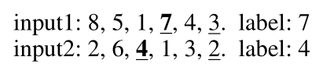

# Long Short-Term Memory with Dynamic Skip Connections

TensorFlow implementation of [Long Short-Term Memory with Dynamic Skip Connections](https://arxiv.org/pdf/1811.03873.pdf) (AAAI 2019).


The code is partially referred to https://github.com/tensorflow/models.

## Requirements

- Python 2.7 or higher
- Numpy
- TensorFlow 1.0

## Usage

### Language Modeling Task

To evaluate the model on the Penn Treebank language model corpus, you can run the following command under the directory of ./LanguageModeling.

```
$ python RL_train.py --rnn_size 650 --rnn_layers 2 --lamda 1 --n_actions 5
```


The hyper-parameters in this model are: 

| Parameter     | Meaning                                        | Default |
| :------------ | :--------------------------------------------- | ------- |
| rnn_size      | size of LSTM internal state                    | 650     |
| rnn_layers    | number of layers in the LSTM                   | 2       |
| dropout       | dropout rate                                   | 0.5     |
| lamda         | lambda value of RL                             | 1       |
| learning_rate | initial learning rate                          | 1.0     |
| lr_threshold  | learning rate stops decreasing after threshold | 0.005   |
| param_init    | initialize parameter range of weights          | 0.05    |
| n_actions     | number of actions to take                      | 5       |

You can change these values by passing the arguments explicitly.


### Number Prediction Task

Given a sequence of L positive integers $x_{T-1}$ , and the label  $y = x_{x_{T-1}}​$, the ideal network should learn to ignore the remaining useless numbers and learn how to skip from the input data. Here are two examples to illustrate the task: 



To investigate this task of number prediction,  you should produce datasets first under the directory of ./NumberPrediction by running:

```
$ python produce_data.py
```

Then, you can reproduce the results on number prediction dataset (with sequence length = 10+1) by executing:

```
$ python train_RL10_1.py
```


## Citation

If you find this code useful, please cite us in your work:

```latex
@article{gui2018long,
  title={Long Short-Term Memory with Dynamic Skip Connections},
  author={Gui, Tao and Zhang, Qi and Zhao, Lujun and Lin, Yaosong and Peng, Minlong and Gong, Jingjing and Huang, Xuanjing},
  journal={arXiv preprint arXiv:1811.03873},
  year={2018}
}
```

